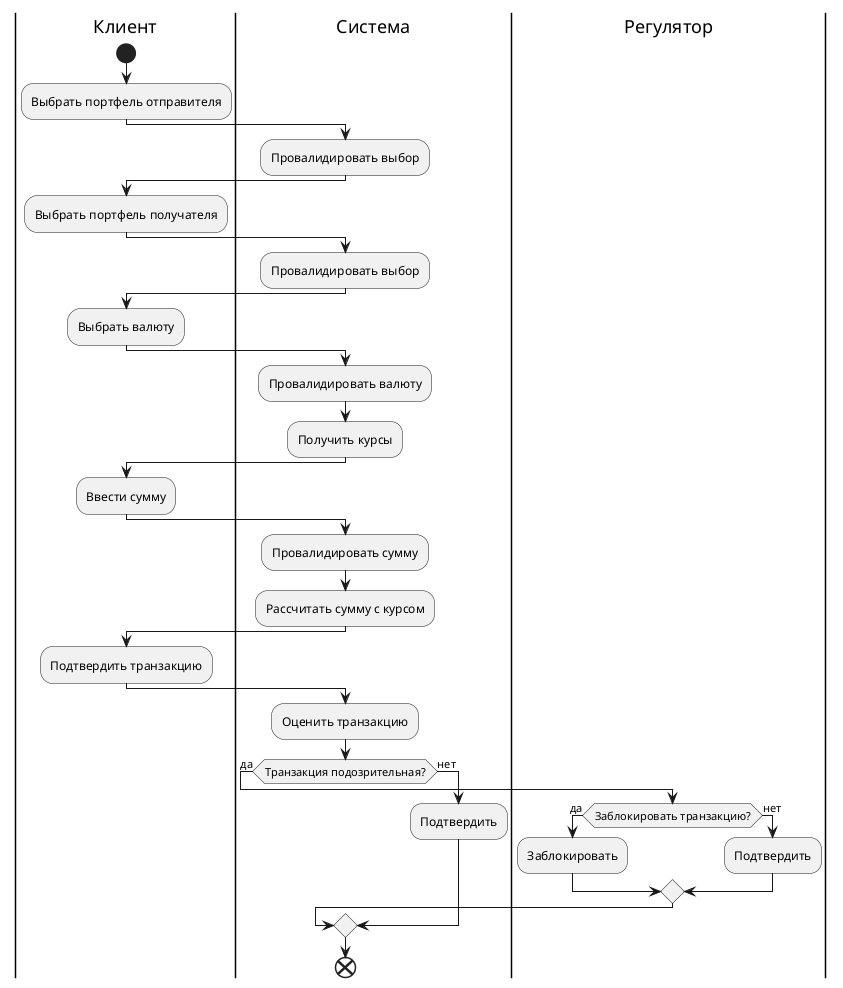

# Activity

```plantuml
@startuml
|Клиент|
start
:Выбрать портфель отправителя;
|Система|
:Провалидировать выбор;
|Клиент|
:Выбрать портфель получателя;
|Система|
:Провалидировать выбор;
|Клиент|
:Выбрать валюту;
|Система|
:Провалидировать валюту;
:Получить курсы;
|Клиент|
:Ввести сумму;
|Система|
:Провалидировать сумму;
:Рассчитать сумму с курсом;
|Клиент|
:Подтвердить транзакцию;
|Система|
:Оценить транзакцию;
if (Транзакция подозрительная?) then (да)
  |Регулятор|
  if (Заблокировать транзакцию?) then (да)
    :Заблокировать;
  else (нет)
    :Подтвердить;
  endif
else (нет)
  |Система|
  :Подтвердить;
endif
end
@enduml
```

