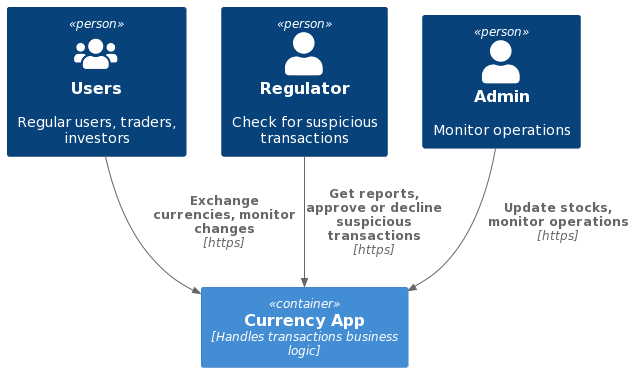

# C4: Контекст

```plantuml
@startuml C4 Context
!include https://raw.githubusercontent.com/plantuml-stdlib/C4-PlantUML/master/C4_Container.puml
!define FONTAWESOME https://raw.githubusercontent.com/tupadr3/plantuml-icon-font-sprites/master/font-awesome-5
!include FONTAWESOME/users.puml

Person(users, "Users", "Regular users, traders, investors", $sprite="users")
Person(regulator, "Regulator", "Check for suspicious transactions")
Person(admin, "Admin", "Monitor operations")

Container(web_app, "Currency App", "Handles users' data, stock rates and transactions business logic")

Rel(users, web_app, "Exchange currencies, monitor changes", "https")
Rel(regulator, web_app, "Get reports, approve or decline suspicious transactions", "https")
Rel(admin, web_app, "Update stock rates, monitor operations", "https")
@enduml
```


