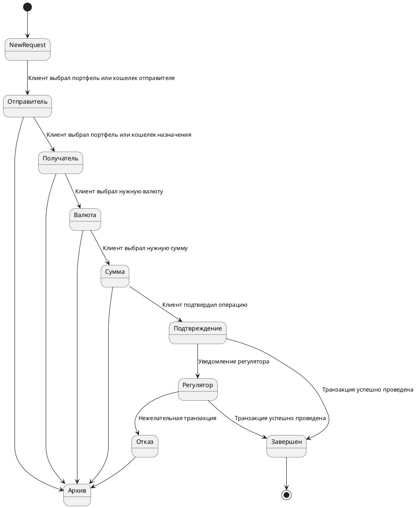
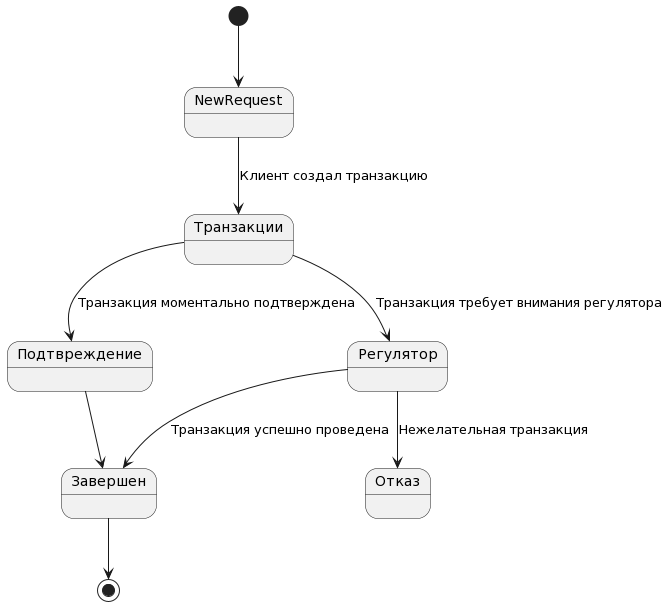

# State

```plantuml
@startuml
state "Отправитель" as Source
state "Получатель" as Destination
state "Валюта" as Currency
state "Сумма" as Sum
state "Подтвреждение" as Approval
state "Регулятор" as Regulator
state "Отказ" as Failure
state "Архив" as Archive
state "Завершен" as Finished
[*] --> NewRequest
NewRequest --> Source : Клиент выбрал портфель или кошелек отправителя
Source --> Destination : Клиент выбрал портфель или кошелек назначения
Source --> Archive
Destination --> Currency : Клиент выбрал нужную валюту
Destination --> Archive
Currency --> Sum : Клиент выбрал нужную сумму
Currency --> Archive
Sum --> Approval : Клиент подтвердил операцию
Sum --> Archive
Approval --> Finished : Транзакция успешно проведена
Approval --> Regulator : Уведомление регулятора
Regulator --> Failure : Нежелательная транзакция
Failure --> Archive
Regulator --> Finished : Транзакция успешно проведена
Finished --> [*]
@enduml
```

